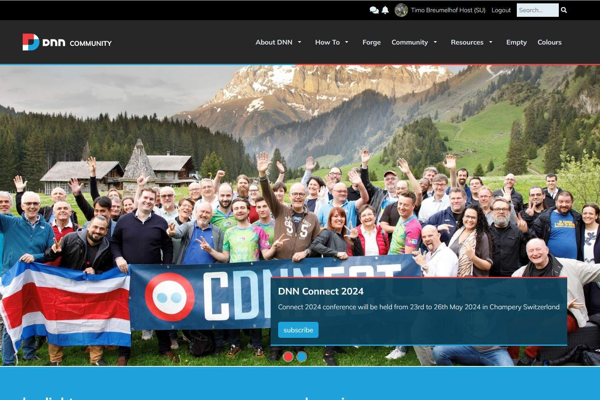

# DNNCMS DNN Community Site Theme
## Bootstrap 5 

## About
New (2023) DNN community site Theme.

## Notes:

- The Theme expects to be in a folder named "DNN-Community-2024" (same for the containers).
- The Theme uses Gulp to parse the SCSS.
- Containers are "on change" copied from the  "_src/Containers" folder to the appropriate DNN container folder.
- The Gulp script assumes the name of your container folder is the same as the skin folder.
- The MS build script currently assumes you have the community build tasks installed en uses 7 Zip.

